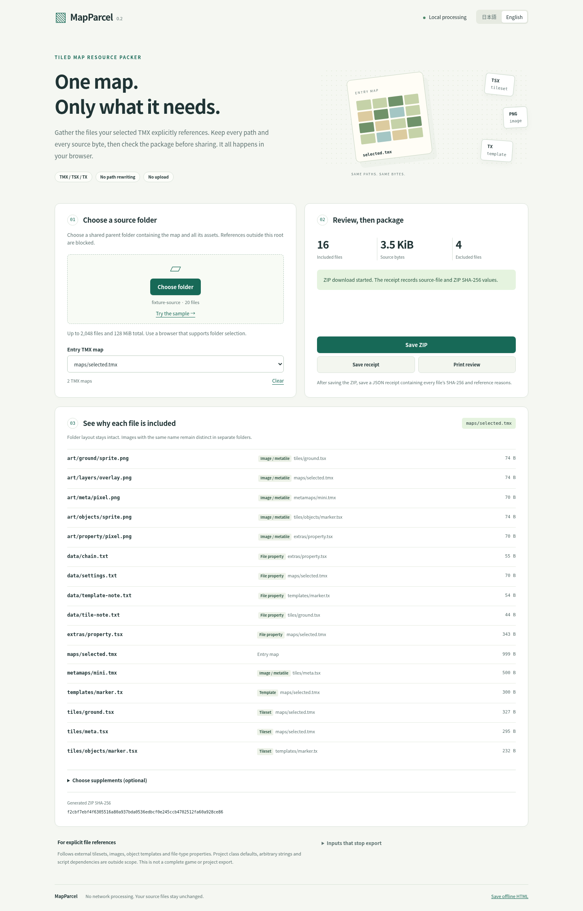

# MapParcel

An offline Japanese/English resource packer for a selected Tiled XML map. It preserves original paths and file bytes.

**Verified: 62 core tests, 19 sandboxed/offline browser scenarios, actual browser ZIP/receipt checks, Japanese/English mobile/keyboard/print review, and official Tiled rendering after relocation.**

[Browser → Tiled verification](https://github.com/Masanori-Spec/map-parcel/actions/runs/37425815870) · [Native core verification](https://github.com/Masanori-Spec/map-parcel/actions/runs/37425815915)



[Japanese mobile screenshot](docs/evidence/mobile-ja.png)

[Native evidence run](https://github.com/Masanori-Spec/map-parcel/actions/runs/37422232310) verified all 32 expected pixels after relocation and caught four missing-image faults, each of which misleadingly returned exit code 0. See [verification](docs/verification.md).

## Use it

1. Open `dist/map-parcel.html` in a current browser. It is a self-contained offline file
2. Choose a common parent folder containing the map and its assets, or try the original sample
3. Select the entry TMX, inspect each included path and its reference reason
4. Optionally select supplementary notes or attribution files. Nothing is selected automatically
5. Save the ZIP, then save its JSON SHA-256 receipt or print the review

Everything is processed locally. There are no uploads, telemetry, accounts or runtime network requests. A folder-selection-capable browser is required; mobile layouts are supported, but folder selection depends on the device/browser. The saved offline HTML starts fresh without retaining the imported folder or receipt.

MapParcel takes a selected XML `.tmx` map and copies its explicitly referenced dependency closure into a ZIP. Original file paths, GIDs and every source byte stay unchanged. It is a narrow sharing tool, not a complete Tiled project exporter or a game dependency scanner.

## Scope

- Follow external TSX tilesets, image sources, object TX templates, and explicit file-type properties
- Recursively follow TMX/TSX/TX documents reached through any supported reference, including a metatile image whose source is another TMX
- Include other explicit file-property files as opaque byte-preserved leaves
- Support external PNG/JPEG/BMP/GIF/WebP images; native feasibility fixture specifically verifies PNG
- Preserve two same-basename files in separate directories
- Exclude unused files and ordinary string properties
- Include license or attribution files only when explicitly selected as supplements. Packaging grants no rights to share someone else's assets

The caller supplies a selected root directory. References must resolve inside it. Absolute paths, URLs, escaping references, ambiguous/colliding paths, symlinks in the filesystem harness, DTDs/entities, namespaces, recursive XML cycles, embedded images, JSON/world/project/SVG dependencies and unknown XML elements, attributes, placements or processing instructions are rejected. Only the conservative TMX element/attribute vocabulary listed in the source is accepted; scalar properties cannot contain child elements. Nonempty `class`, legacy object/tile `type`, custom `propertytype`, class/list properties are conservatively blocked because their dependencies can live in project defaults. Non-UTF-8 XML and empty/directory file properties are blocked. File-property paths require a value attribute or one plain text node; fragmented text, CDATA and mixed attribute/content values are rejected to avoid consumer parsing differences. Some otherwise valid Tiled inputs are intentionally unsupported.

Limits: 2,048 selected input files, 128 MiB total input, 4 MiB per XML file, 20,000 XML elements, depth 128, and 8,192 explicit references. Paths use relative `/` separators and NFC spelling; portable Windows-invalid characters and device names are rejected.

## Local verification

```sh
npm ci --ignore-scripts
npm run verify
```

This runs unit tests, builds the offline HTML, creates original synthetic assets, writes the selected-map ZIP, and checks it using Python's independent ZIP reader against a literal 16-path set and frozen SHA-256 values. The fixture generator does not write the oracle. No Tiled binary is installed or run locally. The HTML bundles the source-only XML parser dependency; its existing license is preserved in `THIRD_PARTY_NOTICES.txt` and inside the HTML. No original-code or fixture license grant is added.

## Hosted native verification

The GitHub Actions workflow downloads the official Tiled 1.12.2 AppImage from its publisher only after checking primary release metadata. It verifies the exact 47,286,776-byte artifact and SHA-256 before extraction or execution. The binary stays in the temporary runner directory and is not a product dependency or an uploaded artifact.

The native gate:

1. Renders the original fixture through official `tmxrasterizer`
2. Checks all 32 pixels against the handwritten 8×4 palette and row oracle
3. Extracts the ZIP into an unrelated directory, removes the generated original input directory, and starts a fresh rasterizer process
4. Checks all relocated pixels against both the handwritten oracle and original native output
5. Removes each of four required PNGs in turn: ground, template object, image layer and metatile image. Each negative control must cause a pixel mismatch, missing image or nonzero exit

Exit status zero alone is never a pass. Artifacts include the ZIP, file/edge manifest, frozen-byte verification report, original/relocated/negative renders, consumer provenance and native report. They exclude vendor binaries.

## Browser verification

`browser-native.yml` uses sandboxed hosted Chrome with networking disabled. It tests real folder selection, actual ZIP and JSON downloads, supplement opt-in, safe rejection, stale import/export cancellation, deterministic repeat exports, keyboard operation, Japanese/English mobile layouts and print PDFs. Python independently checks the downloaded ZIPs and receipts. The actual selected ZIP is then handed to the official Tiled relocation/pixel/negative-control gate. A UI badge or browser exit status is never used as proof of native compatibility.

## Why this exists

Tiled's open [resource-pack request #4446](https://github.com/mapeditor/tiled/issues/4446) describes the problem of gathering external files for sharing. The related [dependency-browser PR #4458](https://github.com/mapeditor/tiled/pull/4458) was open and unmerged at research time (2026-10-06); its reviewed implementation lists and opens dependencies but does not package them. See [research and boundaries](docs/research.md).

No license has been selected for the original software or synthetic fixture assets. Publication for inspection does not grant reuse rights. Input assets retain their own licenses.
